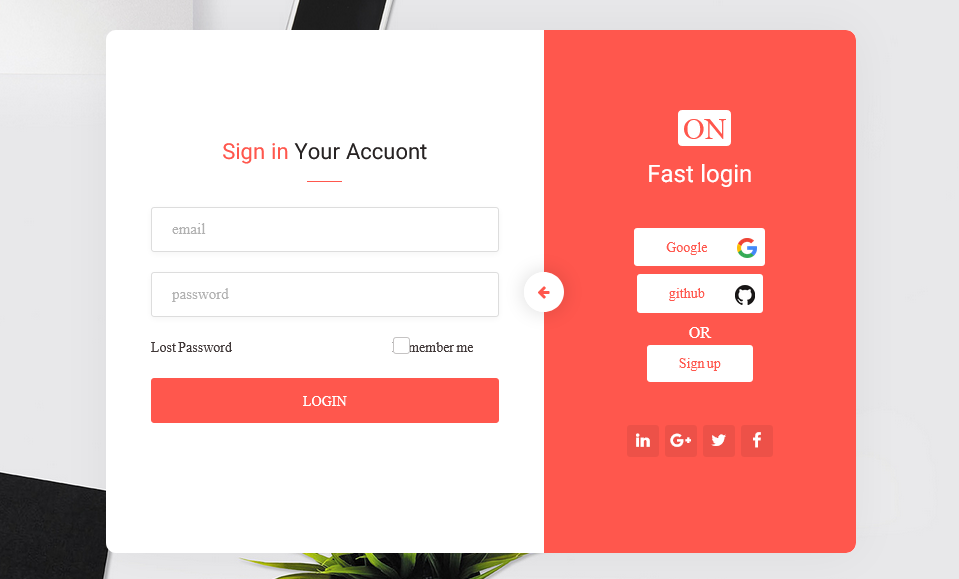

  

 

# Getting Started

Clone the Login-react 
### `git clone https://github.com/omidnami/react-login.git`

Install dependencies 
### `npm install`

In the project directory, you can run:

### `npm start`

Runs the app in the development mode.\
Open [http://localhost:3000](http://localhost:3000) to view it in your browser.

This project have a router service managment whith react-router-dom

This project have handler file (handeler.js) for per componnent
